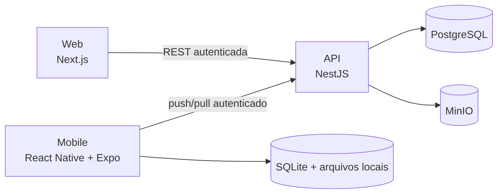

# Registro de Campo

Plataforma offline-first para coleta de registros em campo com fotografia e geolocalização. O projeto reúne um aplicativo mobile, uma API REST e um painel administrativo web em um monorepo TypeScript.

O principal objetivo técnico é manter o trabalho de campo disponível mesmo sem internet. O aplicativo grava registros e operações localmente, permite consultar documentos já baixados e sincroniza as alterações quando a conexão retorna, sem expor os dados locais de um usuário para outro.

## Visão geral



### Mobile

- Login e restauração segura da sessão pelo Keychain/Keystore.
- Criação, consulta, edição e exclusão lógica de registros sem conexão.
- Captura de fotografia e geolocalização.
- SQLite como fonte local para registros, fila de sincronização, conflitos e catálogo de documentos.
- Sincronização automática ao recuperar conectividade e acionamento manual.
- Isolamento de registros, fila e cursor por usuário autenticado.
- Comparação e resolução manual de conflitos.
- Download e visualização offline de documentos.
- Estados visuais para itens pendentes, sincronizados e em conflito.

### Web

- Login e controle de acesso por perfil.
- Dashboard administrativo com indicadores, busca, fotografias, coordenadas, mapa e exclusão lógica.
- Visualização global dos registros por administradores.
- Gestão de usuários de campo, incluindo criação, edição, bloqueio, reativação e redefinição de senha.
- Publicação, substituição, download e ativação de documentos.

### Backend

- API REST compartilhada pelo web e pelo mobile.
- Access token e refresh token JWT com sessões revogáveis.
- Senhas protegidas com hash bcrypt.
- Controle de acesso com perfis `ADMIN` e `FIELD_USER`.
- PostgreSQL com Prisma ORM.
- Fotografias e documentos armazenados no MinIO por API compatível com S3.
- Uploads com limite de tamanho, tipos permitidos e validação da assinatura do arquivo.
- Sincronização incremental `push/pull`, operações idempotentes e versionamento otimista.

## Tecnologias

| Camada           | Tecnologias                                                   |
| ---------------- | ------------------------------------------------------------- |
| Mobile           | React Native, Expo, Expo Router, NativeWind e TypeScript      |
| Dados locais     | Expo SQLite e Expo File System                                |
| Recursos nativos | Expo Camera, Location, Secure Store e Sharing                 |
| Web              | Next.js, React, shadcn/ui, Tailwind CSS, Leaflet e TypeScript |
| API              | Node.js, NestJS, Passport, JWT e class-validator              |
| Persistência     | PostgreSQL e Prisma ORM                                       |
| Arquivos         | MinIO, com API compatível com Amazon S3                       |
| Infraestrutura   | Docker e Docker Compose                                       |
| Monorepo         | pnpm Workspaces                                               |
| Qualidade        | TypeScript, Prettier e smoke test automatizado                |

## Estrutura do repositório

```text
apps/
  api/                 API NestJS, Prisma e teste de integração
  mobile/              aplicativo React Native com Expo
  web/                 painel administrativo Next.js
packages/
  shared-types/        contratos TypeScript compartilhados
docs/
  architecture.md      detalhes adicionais da arquitetura
docker-compose.yml     PostgreSQL e MinIO para desenvolvimento
```

## Como rodar localmente

### Pré-requisitos

- macOS, Linux ou Windows com Docker disponível.
- Node.js `22.13` ou superior. O projeto foi validado com Node.js `22.23.2`.
- pnpm `11`. O repositório fixa a versão `11.25.0` no `package.json`.
- Docker Desktop com Docker Compose.
- Para iOS: Xcode e um simulador instalado.
- Para Android: Android Studio e um emulador configurado.

Confira as ferramentas:

```bash
node --version
pnpm --version
docker --version
docker compose version
```

### 1. Instalar as dependências

Na raiz do repositório:

```bash
pnpm install
```

### 2. Configurar as variáveis de ambiente

Crie o arquivo principal de ambiente:

```bash
cp .env.example .env
```

Crie também o ambiente do aplicativo mobile:

```bash
cp apps/mobile/.env.example apps/mobile/.env
```

Cada comando acima deve ser executado separadamente. Antes de iniciar a API, substitua no `.env` as chaves JWT e a senha do administrador por valores locais seguros. Uma chave pode ser gerada com:

```bash
openssl rand -hex 32
```

Execute o comando duas vezes e use valores diferentes em `JWT_ACCESS_SECRET` e `JWT_REFRESH_SECRET`.

Variáveis principais:

| Variável              | Finalidade                                     | Valor local esperado                         |
| --------------------- | ---------------------------------------------- | -------------------------------------------- |
| `DATABASE_URL`        | Conexão Prisma com PostgreSQL                  | PostgreSQL na porta `5433`                   |
| `MINIO_ENDPOINT`      | Endpoint S3 usado pela API                     | `http://localhost:9000`                      |
| `MINIO_BUCKET`        | Bucket de fotos e documentos                   | `registro-arquivos`                          |
| `API_PORT`            | Porta da API                                   | `3001`                                       |
| `WEB_PORT`            | Porta utilizada pelo web                       | `3000`                                       |
| `CORS_ORIGINS`        | Origens web autorizadas, separadas por vírgula | localhost nas portas do web                  |
| `JWT_ACCESS_SECRET`   | Assinatura do access token                     | chave aleatória longa                        |
| `JWT_REFRESH_SECRET`  | Assinatura do refresh token                    | outra chave aleatória longa                  |
| `SEED_ADMIN_EMAIL`    | Login inicial do administrador                 | definido pelo desenvolvedor                  |
| `SEED_ADMIN_PASSWORD` | Senha inicial do administrador                 | senha forte local                            |
| `EXPO_PUBLIC_API_URL` | URL acessada pelo mobile                       | `http://localhost:3001/api` no simulador iOS |

O web usa `http://localhost:3001/api` por padrão. Para alterar esse endereço, crie `apps/web/.env.local`:

```dotenv
NEXT_PUBLIC_API_URL=http://localhost:3001/api
```

Em um aparelho físico, `localhost` aponta para o próprio aparelho. Nesse caso, ajuste `apps/mobile/.env` para o IP do Mac na rede local, por exemplo:

```dotenv
EXPO_PUBLIC_API_URL=http://192.168.0.10:3001/api
```

No emulador Android, normalmente use `http://10.0.2.2:3001/api`.

### 3. Iniciar PostgreSQL e MinIO

```bash
docker compose up -d
```

Confira o estado dos containers:

```bash
docker compose ps
```

Serviços locais:

| Serviço       | Endereço                |
| ------------- | ----------------------- |
| PostgreSQL    | `localhost:5433`        |
| MinIO API     | `http://localhost:9000` |
| MinIO Console | `http://localhost:9001` |

A porta externa `5433` evita conflito com uma instalação local do PostgreSQL que já utilize a porta padrão `5432`.

### 4. Preparar o banco de dados

Gere o Prisma Client, aplique as migrations e crie o administrador inicial:

```bash
pnpm --filter @registro/api prisma:generate
pnpm --filter @registro/api prisma:migrate
pnpm --filter @registro/api prisma:seed
```

O login inicial será o conteúdo de `SEED_ADMIN_EMAIL` e `SEED_ADMIN_PASSWORD` do seu arquivo `.env`. Depois de entrar no painel, o administrador pode criar usuários de campo.

### 5. Iniciar as aplicações

Use três terminais, todos abertos na raiz do projeto.

Terminal 1 — API:

```bash
pnpm dev:api
```

Terminal 2 — web:

```bash
pnpm dev:web
```

Terminal 3 — mobile:

```bash
pnpm dev:mobile
```

No terminal do Expo, pressione `i` para abrir o simulador iOS ou `a` para abrir o Android. No macOS, o iOS também pode ser iniciado diretamente com:

```bash
pnpm --filter @registro/mobile ios
```

Aplicações disponíveis:

- Web: `http://localhost:3000`
- API: `http://localhost:3001/api`
- Health check: `http://localhost:3001/api/health`

Para encerrar somente a infraestrutura:

```bash
docker compose down
```

Os volumes do PostgreSQL e MinIO são mantidos por esse comando.

## Decisões técnicas e arquiteturais

### Monorepo com pnpm Workspaces

Mobile, web, API e tipos compartilhados vivem no mesmo repositório. Isso reduz divergência entre contratos, centraliza scripts e facilita mudanças que atravessam mais de uma camada. O pnpm foi escolhido pelo uso eficiente de disco e pelo suporte nativo a workspaces.

### React Native com Expo

O Expo acelera o acesso a câmera, localização, SQLite, armazenamento seguro e sistema de arquivos sem exigir configuração nativa extensa para o MVP. React Native também permite compartilhar linguagem, padrões e conhecimento com o frontend React, embora os componentes visuais continuem adequados às plataformas móveis.

### SQLite como fonte local do mobile

Registros são gravados primeiro no SQLite, e não diretamente na API. Assim, salvar um registro não depende da rede e o estado sobrevive ao fechamento do aplicativo. A fila de operações e o cursor de sincronização também são persistentes, permitindo retomar uma sincronização interrompida.

### PostgreSQL e Prisma

O PostgreSQL oferece integridade relacional, transações e tipos adequados para os dados centrais. O Prisma mantém o schema versionado, gera um cliente tipado e torna as migrations reproduzíveis. O arquivo principal está em `apps/api/prisma/schema.prisma`.

Comandos úteis durante o desenvolvimento:

```bash
# Abrir uma interface visual para consultar o banco
pnpm --filter @registro/api prisma:studio

# Após alterar o schema, criar e aplicar uma migration
pnpm --filter @registro/api prisma:migrate --name nome_da_alteracao

# Atualizar o cliente tipado do Prisma
pnpm --filter @registro/api prisma:generate
```

### MinIO para armazenamento de arquivos

Fotos e documentos não são gravados dentro do PostgreSQL. O banco mantém metadados e chaves, enquanto os binários ficam no MinIO. Isso evita aumentar o banco relacional com arquivos grandes e mantém compatibilidade com soluções S3 em uma futura implantação. Downloads usam URLs temporárias assinadas.

### Autenticação e autorização

O access token tem duração curta e o refresh token está ligado a uma sessão persistida no banco. O hash do refresh token, e não o token puro, é armazenado. Bloquear um usuário, trocar sua senha ou encerrar a sessão revoga o acesso no servidor. No mobile, tokens ficam no Secure Store do sistema operacional.

O perfil `FIELD_USER` acessa somente seus próprios registros pelo fluxo de sincronização. O perfil `ADMIN` possui endpoints específicos para consultar todos os registros, gerenciar usuários e publicar documentos.

### Exclusão lógica

Registros usam `deletedAt` em vez de remoção física imediata. Esse tombstone é necessário para que clientes offline descubram que um registro foi excluído no servidor e não o recriem silenciosamente ao sincronizar.

### Sistema visual compartilhado

O web usa shadcn/ui e Tailwind CSS. O mobile usa NativeWind e componentes nativos equivalentes. A identidade visual é compartilhada, mas interações e acessibilidade seguem as convenções de cada plataforma.

## Estratégia de sincronização

A implementação combina fila persistente, identificadores gerados no cliente, operações idempotentes, pull incremental e controle otimista de concorrência.

### Fluxo

1. O mobile cria um UUID para o registro e o salva no SQLite com estado `PENDING`.
2. A mesma transação local adiciona uma operação à `sync_queue`, com `operationId`, tipo e `baseVersion`.
3. Quando há conexão, a foto pendente é enviada primeiro ao MinIO por meio da API.
4. O mobile envia a operação para `POST /api/sync/push`.
5. O servidor usa `operationId` para tornar reenvios idempotentes.
6. Se a operação for aceita, o servidor incrementa a versão e o mobile marca o registro como `SYNCED`.
7. Depois do push, `GET /api/sync/pull` busca alterações posteriores ao cursor daquele usuário.
8. Registros e o novo cursor são aplicados juntos no SQLite.

O retorno da conectividade inicia esse fluxo automaticamente. Também existe sincronização manual. Falhas de rede mantêm os dados e as operações no dispositivo para uma tentativa posterior.

### Tratamento de conflitos

Foi escolhido versionamento otimista, em vez de aplicar apenas _last write wins_. Cada registro possui `version`, e toda edição ou exclusão envia a `baseVersion` conhecida pelo cliente.

- Se `baseVersion` corresponde à versão atual, a operação é aplicada.
- Se as versões divergem, o servidor retorna `CONFLICT` e uma cópia do registro atual.
- Se o registro foi excluído no servidor, o conflito recebe o motivo `RECORD_DELETED`.
- Se a operação tenta acessar dados pertencentes a outra conta ou contém uma referência inválida, retorna `REJECTED`.
- Reenviar o mesmo `operationId` não duplica o efeito da operação.

No conflito, a edição local é preservada e o usuário pode:

- **Usar a versão do servidor:** descarta a operação local e atualiza o SQLite.
- **Manter a versão local:** cria uma nova operação idempotente baseada na versão mais recente do servidor.

Essa estratégia foi escolhida porque um _last write wins_ automático poderia apagar silenciosamente uma coleta válida feita offline. A decisão explícita é mais segura para dados de campo e deixa o conflito auditável. Como otimização, alterações sucessivas ainda pendentes do mesmo registro são consolidadas localmente.

### Isolamento por usuário

As tabelas locais incluem `owner_user_id`, e consultas, pendências, conflitos e cursores são filtrados pela conta autenticada. No backend, o usuário é obtido do JWT; o cliente não escolhe o proprietário do registro. Fotografias também usam um prefixo de armazenamento vinculado ao usuário.

## Documentos offline

O painel administrativo publica arquivos no MinIO e mantém versão, status e checksum SHA-256 no PostgreSQL. O mobile sincroniza o catálogo, mas baixa cada documento somente quando solicitado.

O arquivo é salvo no diretório permanente do aplicativo. Se uma nova versão for publicada, a versão já baixada continua disponível até o novo download terminar, evitando perder o acesso offline por causa de uma atualização incompleta.

## Segurança aplicada ao MVP

- Senhas com bcrypt e fator de custo 12.
- Access tokens curtos, refresh tokens com hash e sessões revogáveis.
- Autorização por perfil e verificação de propriedade dos registros e fotografias.
- DTOs com whitelist, rejeição de campos desconhecidos e limites de tamanho.
- Validação de latitude, longitude, UUIDs e datas.
- CORS restrito às origens configuradas.
- Uploads com limite de tamanho, lista de MIME types e verificação de assinatura do conteúdo.
- Links temporários para download no armazenamento de objetos.
- Segredos e arquivos de ambiente fora do controle de versão.

Essas medidas formam uma base adequada para o MVP, mas não substituem TLS, gestão de segredos, observabilidade e proteção de infraestrutura em produção.

## Qualidade e testes

Verificação estática de todos os pacotes:

```bash
pnpm typecheck
pnpm format:check
pnpm --filter @registro/api build
pnpm --filter @registro/web build
```

Com a API, PostgreSQL e MinIO em execução, rode o smoke test:

```bash
pnpm test:smoke
```

O teste cria dados temporários e valida, entre outros pontos:

- login, renovação e revogação de sessão;
- permissões de administrador e usuário de campo;
- isolamento de registros entre contas;
- criação, atualização, exclusão e idempotência;
- conflito entre edição offline e exclusão no servidor;
- rejeição de coordenadas e propriedades inválidas;
- proteção contra associação de fotografia de outra conta;
- validação básica de upload e CORS.

Ao final, os registros, sessões e usuário temporários são removidos.

## O que melhoraria com mais tempo

### Prioridade alta

- Adicionar testes unitários e de integração por módulo, além de testes E2E para web e mobile.
- Paginar o pull de sincronização com cursor composto. O limite atual de 500 alterações é suficiente para o MVP, mas precisa de paginação antes de operar em maior escala.
- Tornar a aplicação concorrente mais robusta com atualização condicional de versão no banco, evitando uma janela de corrida entre leitura e escrita.
- Adicionar retry com _exponential backoff_ e jitter para sincronizações e uploads.
- Instrumentar logs estruturados, métricas, rastreamento e alertas.

### Segurança e produção

- Aplicar rate limiting e proteção contra tentativas repetidas de login.
- Usar cookies `HttpOnly` no web ou uma camada BFF para reduzir a exposição dos tokens ao JavaScript.
- Integrar antivírus ou análise assíncrona para documentos enviados.
- Usar TLS, secrets manager, rotação de chaves e credenciais diferentes por ambiente.
- Executar análise de dependências e segurança no CI.

### Produto e experiência

- Resolver automaticamente conflitos em campos independentes e manter histórico/auditoria das decisões.
- Permitir sincronização de lotes com progresso granular, cancelamento e retomada de uploads grandes.
- Verificar o checksum do arquivo também no dispositivo após o download.
- Adicionar acessibilidade auditada, internacionalização e testes em aparelhos reais.
- Implementar notificações sobre novos documentos e sincronizações que exigem decisão.

### Entrega

- Dockerizar API e web e adicionar health checks e dependências entre serviços.
- Criar pipeline de CI/CD com typecheck, testes, builds e migrations de produção.
- Separar configurações de desenvolvimento, homologação e produção.
- Publicar builds assinados do mobile e definir uma estratégia de atualizações.

## Limitações conhecidas do MVP

- A infraestrutura Docker atual inicia PostgreSQL e MinIO; API e web ainda são executados pelo Node.js local.
- O pull incremental retorna no máximo 500 alterações por execução e ainda não possui paginação.
- Conflitos são resolvidos por registro inteiro, não por campo.
- A cobertura atual é concentrada no smoke test da API; ainda não há uma suíte completa de testes de interface.
- A configuração fornecida é voltada ao desenvolvimento local, não a uma implantação pública.

## Documentação complementar

- [Arquitetura e decisões internas](docs/architecture.md)
- [Referência funcional da API](docs/api.md)
- [Plano de validação e roteiro de testes](docs/testing.md)
