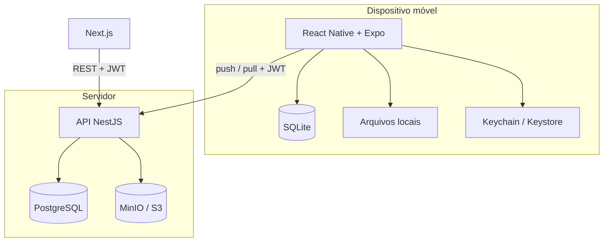
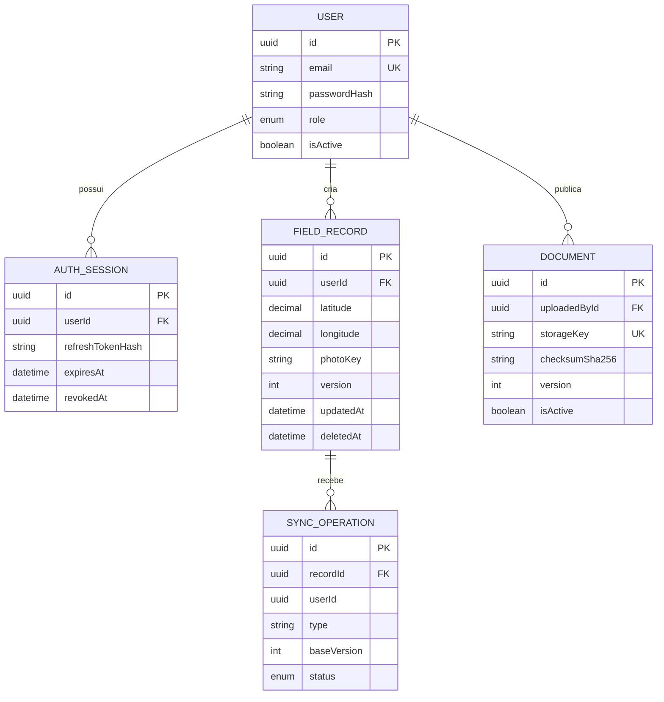
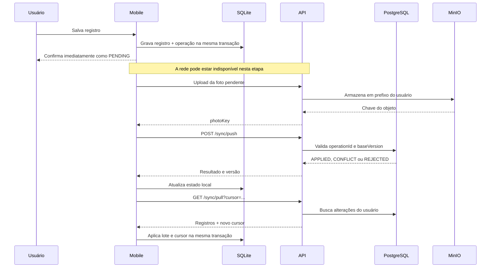
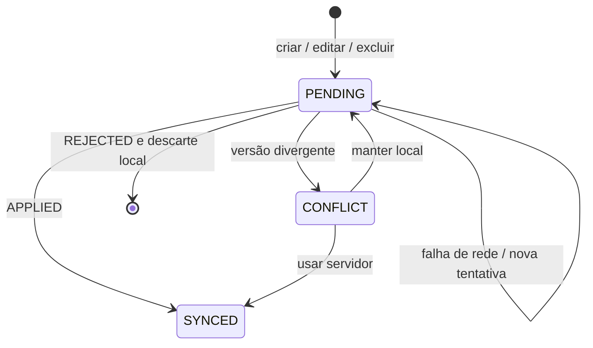

# Arquitetura

Este documento descreve a arquitetura implementada no MVP Registro de Campo. As instruções de instalação estão no [README](../README.md), a relação de endpoints está em [api.md](api.md) e os cenários manuais de validação estão em [testing.md](testing.md).

## Objetivos arquiteturais

O sistema foi desenhado em torno de quatro requisitos:

1. O trabalho de campo não pode depender de conectividade.
2. Reenvios causados por uma rede instável não podem duplicar alterações.
3. Uma alteração concorrente não pode apagar dados silenciosamente.
4. Contas diferentes no mesmo aparelho não podem compartilhar cache ou pendências.

## Visão de componentes



| Componente              | Responsabilidade                                                                                |
| ----------------------- | ----------------------------------------------------------------------------------------------- |
| `apps/mobile`           | Interface de campo, persistência local, câmera, localização, documentos offline e sincronização |
| `apps/web`              | Dashboard global e administração de usuários, registros e documentos                            |
| `apps/api`              | Autenticação, autorização, regras de domínio, sincronização e acesso à persistência             |
| `packages/shared-types` | Contratos TypeScript compartilhados pelos clientes                                              |
| PostgreSQL              | Fonte central dos dados estruturados e das sessões                                              |
| MinIO                   | Armazenamento dos arquivos binários                                                             |
| SQLite                  | Fonte local do mobile durante uso online e offline                                              |

## Modelo de dados central



O schema completo e executável está em `apps/api/prisma/schema.prisma`. Migrations versionadas permitem reproduzir a estrutura do PostgreSQL.

## Persistência local

O mobile utiliza quatro conjuntos de dados principais:

| Tabela          | Conteúdo                                                                     |
| --------------- | ---------------------------------------------------------------------------- |
| `field_records` | Cópia local dos registros, versão, proprietário e estado de sincronização    |
| `sync_queue`    | Operações ainda não confirmadas pelo servidor e dados de eventuais conflitos |
| `sync_state`    | Cursor incremental separado por usuário                                      |
| `documents`     | Catálogo, versão e caminho dos documentos baixados                           |

Fotos capturadas e documentos baixados são mantidos no diretório permanente do aplicativo. Tokens ficam no Expo Secure Store, fora do SQLite.

### Migração do cache por usuário

Versões iniciais do MVP não armazenavam o proprietário no SQLite. Na migração:

- registros sincronizados sem proprietário permanecem ocultos até serem confirmados por um pull autenticado;
- registros pendentes ou em conflito são associados à sessão local restaurada;
- novos registros sempre recebem `owner_user_id` no momento da criação.

Isso preserva trabalho offline existente sem entregar dados ambíguos a outra conta.

## Autenticação e autorização

O login cria uma sessão em `auth_sessions` e devolve:

- access token JWT com validade de 15 minutos;
- refresh token JWT com validade de 30 dias;
- perfil do usuário.

O banco armazena apenas o hash bcrypt do refresh token. Cada requisição protegida verifica assinatura, expiração, sessão não revogada e usuário ativo. Logout, troca de senha, redefinição administrativa ou bloqueio invalidam sessões conforme a regra correspondente.

### Perfis

| Recurso                              | `FIELD_USER` |                       `ADMIN` |
| ------------------------------------ | -----------: | ----------------------------: |
| Sincronizar registros próprios       |          Sim |                           Sim |
| Consultar registros de outra conta   |          Não | Pelo dashboard administrativo |
| Consultar e baixar documentos ativos |          Sim |                           Sim |
| Criar ou substituir documentos       |          Não |                           Sim |
| Gerenciar usuários                   |          Não |                           Sim |
| Excluir registros no dashboard       |          Não |                           Sim |

O identificador do proprietário vem do JWT validado. Ele não é aceito do payload enviado pelo cliente.

## Sincronização

O protocolo usa duas fases: primeiro o envio das operações locais (`push`), depois a leitura incremental do servidor (`pull`).



### Operações idempotentes

Cada alteração recebe um `operationId` UUID. O servidor persiste o resultado da operação. Se o mobile reenviar o mesmo identificador após um timeout, a API devolve o resultado já conhecido em vez de repetir a alteração.

O `recordId` também é gerado no cliente. Isso permite criar relações locais e repetir uma criação sem depender de um identificador retornado pela rede.

### Versionamento otimista

Cada registro central possui uma `version`. Uma operação envia a `baseVersion` que existia quando o usuário começou sua alteração.

| Condição                                                 | Resultado                              |
| -------------------------------------------------------- | -------------------------------------- |
| Criação e UUID ainda inexistente                         | `APPLIED`, registro criado na versão 1 |
| Registro pertence ao usuário e `baseVersion` coincide    | `APPLIED`, versão incrementada         |
| Registro pertence ao usuário e a versão diverge          | `CONFLICT`                             |
| Registro foi excluído após a versão local                | `CONFLICT` com `RECORD_DELETED`        |
| Registro pertence a outra conta ou referência é inválida | `REJECTED`                             |
| `operationId` já processado pelo mesmo usuário           | Resultado anterior, sem novo efeito    |

### Resolução de conflitos

O MVP evita _last write wins_ automático porque ele poderia descartar silenciosamente uma coleta válida feita offline. Quando existe divergência, o servidor devolve sua versão e o mobile preserva ambas para decisão explícita.

- **Usar servidor:** substitui a cópia local e remove a operação pendente.
- **Manter local:** gera um novo `operationId`, atualiza a `baseVersion` e tenta reaplicar os dados locais.

Conflitos são resolvidos pelo registro inteiro. Uma evolução possível é comparar campos alterados e mesclar automaticamente mudanças independentes.

### Pull incremental

O cursor é um timestamp ISO armazenado por usuário. A API devolve alterações com `updatedAt` posterior ao cursor e anterior ao limite superior capturado no início da consulta. Exclusões lógicas também retornam e funcionam como tombstones no dispositivo.

O lote atual é limitado a 500 itens. Para produção, o cursor deve ser composto por `updatedAt` e `id`, e a resposta precisa indicar paginação até consumir o limite superior. Isso evita lacunas quando houver mais de 500 alterações entre duas sincronizações.

### Estados locais



Alterações sucessivas ainda pendentes do mesmo registro são consolidadas em uma operação local, reduzindo tráfego e conflitos desnecessários.

## Documentos offline

Documentos possuem metadados no PostgreSQL e conteúdo no MinIO.

1. O administrador envia um arquivo.
2. A API valida tamanho, MIME type e assinatura do conteúdo.
3. O MinIO recebe o binário e o PostgreSQL recebe chave, versão e checksum SHA-256.
4. O mobile sincroniza apenas o catálogo ativo.
5. A pedido do usuário, a API gera uma URL temporária e o mobile salva o arquivo localmente.
6. Quando surge uma nova versão, o arquivo anterior permanece acessível até o novo download terminar.

Desativar um documento o remove do catálogo remoto. O mobile atualiza os metadados e remove arquivos que deixaram de estar disponíveis.

## Armazenamento de objetos

As chaves seguem prefixos controlados pela API:

```text
records/{userId}/{uuid}.jpg
records/{userId}/{uuid}.png
documents/{documentId}/{uuid}.{extensão}
```

O cliente não recebe credenciais do MinIO. Uploads passam pela API, e downloads utilizam URLs assinadas de curta duração. Uma operação de sincronização não pode associar ao registro uma fotografia cujo prefixo pertença a outro usuário.

## Consistência e transações

- Criação ou alteração de registro e gravação do resultado da operação ocorrem em uma transação PostgreSQL.
- Registro local e entrada da fila são gravados em uma transação SQLite.
- Aplicação do pull e atualização do cursor ocorrem em uma transação SQLite.
- Exclusões são lógicas para que possam ser propagadas a dispositivos offline.

O MVP ainda faz leitura da versão antes da transação de atualização. Sob concorrência elevada, duas requisições simultâneas podem atravessar essa janela. A evolução indicada é usar atualização condicional (`WHERE id = ? AND version = ?`) e confirmar que exatamente uma linha foi alterada.

## Segurança e fronteiras de confiança

- A API considera JWT e banco como fontes de identidade e autorização.
- DTOs rejeitam propriedades desconhecidas e validam limites, UUIDs, coordenadas e datas.
- CORS autoriza apenas as origens configuradas para o web.
- Senhas e refresh tokens são armazenados como hashes bcrypt.
- Arquivos são limitados por tamanho, MIME type e assinatura binária.
- Segredos ficam em arquivos de ambiente ignorados pelo Git.

Para produção ainda seriam necessários TLS, rate limiting, gestão externa de segredos, análise antimalware, logs de auditoria e observabilidade.

## Prisma

Prisma é a camada tipada entre a API e o PostgreSQL. O schema define modelos, relações, índices e enums; migrations mantêm a evolução reproduzível.

```bash
# Criar/aplicar uma migration durante o desenvolvimento
pnpm --filter @registro/api prisma:migrate --name nome_da_alteracao

# Atualizar o cliente TypeScript após alterar o schema
pnpm --filter @registro/api prisma:generate

# Inspecionar os dados por interface visual
pnpm --filter @registro/api prisma:studio
```

Em uma implantação de produção, migrations existentes devem ser aplicadas com `prisma migrate deploy`, e não com `migrate dev`.

## Limites deliberados do MVP

- API e web são executados pelo Node.js local; o Compose atual contém PostgreSQL e MinIO.
- O pull não pagina além de 500 alterações.
- Conflitos são resolvidos por registro, sem merge por campo.
- Fotos já enviadas podem permanecer no armazenamento se uma operação posterior for rejeitada; uma rotina de limpeza é uma evolução recomendada.
- O smoke test cobre o fluxo central da API, mas ainda não existem suítes E2E de interface.
